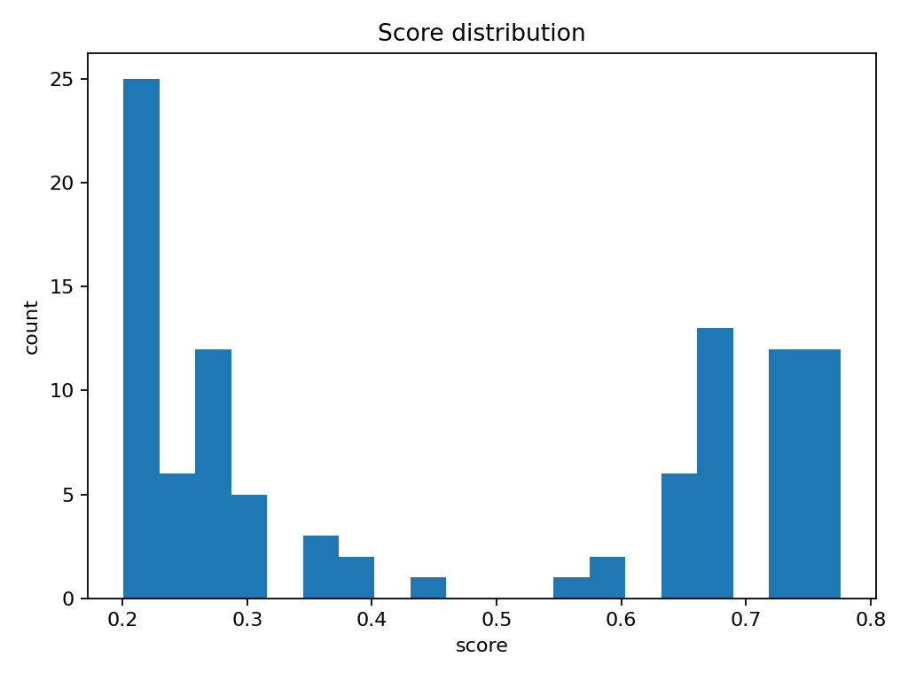

<p align="left">
  <a href="https://www.python.org/"></a>
  <a href="./LICENSE"></a>
  <a href="https://github.com/saraandrade0/ml-pipeline-tokenization/commits/main"></a>
  <a href="https://github.com/saraandrade0/ml-pipeline-tokenization/stargazers"></a>
</p>


# 🧩 ML Pipeline: Tokenization & Classification

This project demonstrates an **end-to-end machine learning pipeline** for text classification using **Python** and **scikit-learn**.  
It includes everything from preprocessing raw text to training a model and scoring new data.

---

## 🚀 Features
- 📂 Load datasets from CSV (`id`, `text`, `label`)
- ✨ Text preprocessing with **TF-IDF vectorization**
- 🤖 Model training with **Logistic Regression**
- 💾 Save and reuse vectorizers and models with **Joblib**
- 📊 Score new datasets and export results to CSV

---
```
## 📂 Project Structure
ml-pipeline-tokenization/
├── data/ # sample data (tiny CSVs, not sensitive!)
├── models/ # trained models (ignored in .gitignore)
├── src/
│ ├── tokenization.py # build TF-IDF vocabulary
│ ├── training.py # train logistic regression classifier
│ └── score.py # apply model and generate scores
├── utils.py # helper functions
├── requirements.txt # dependencies
└── README.md
```

## ⚡ Quickstart

Clone the repository:
```
git clone git@github.com:saraandrade0/ml-pipeline-tokenization.git
cd ml-pipeline-tokenization
```
Create and activate a virtual environment:
```

python -m venv .venv
source .venv/bin/activate   # macOS/Linux
.venv\Scripts\activate      # Windows
```
Install dependencies:
```
pip install -r requirements.txt

```
1️⃣ Build the TF-IDF vectorizer
```
python src/tokenization.py
```
2️⃣ Train the classifier
```
python src/training.py
```
3️⃣ Score a dataset

python src/score.py data/samples.csv
```
Output:

models/tfidf.joblib
models/modelo_lr.joblib
scores.csv
```


## 📈 Score distribution


Below is the distribution of predicted probabilities on the sample dataset:

<p align="center">
  
</p>


## 📐 Threshold metrics 

| threshold | precision | recall | f1   |
|-----------|-----------|--------|------|
| 0.30      | 0.78      | 0.86   | 0.82 |
| 0.50      | 0.81      | 0.80   | 0.80 |
| 0.70      | 0.88      | 0.65   | 0.75 |

```
🛠️ Tech Stack
```
Python 3.11+

pandas

scikit-learn

joblib
```
🔗 Author
```
Made by Sara Andrade
Feel free to fork, star ⭐, and reach out if you’d like to collaborate!
